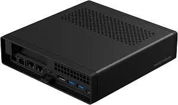
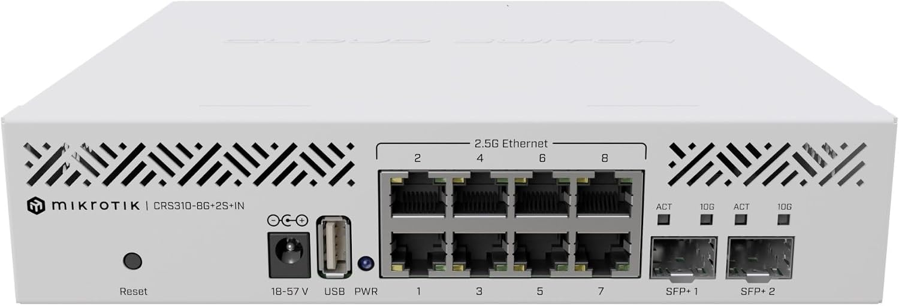
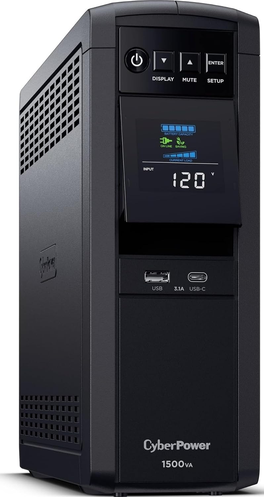
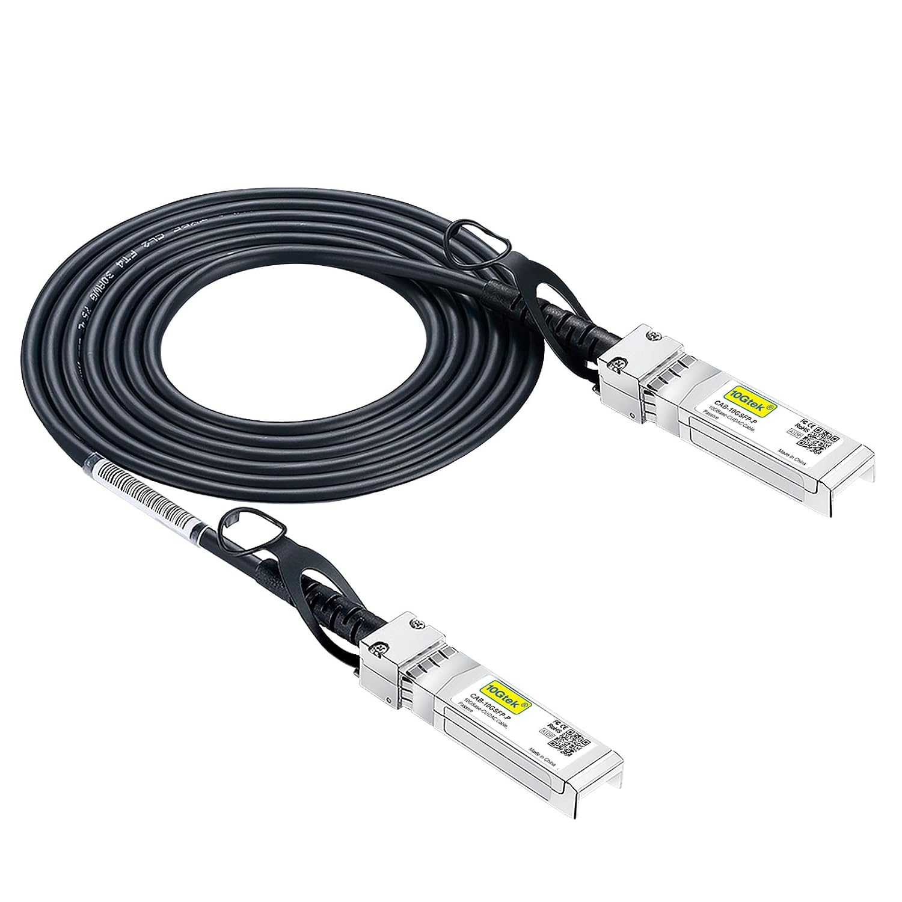
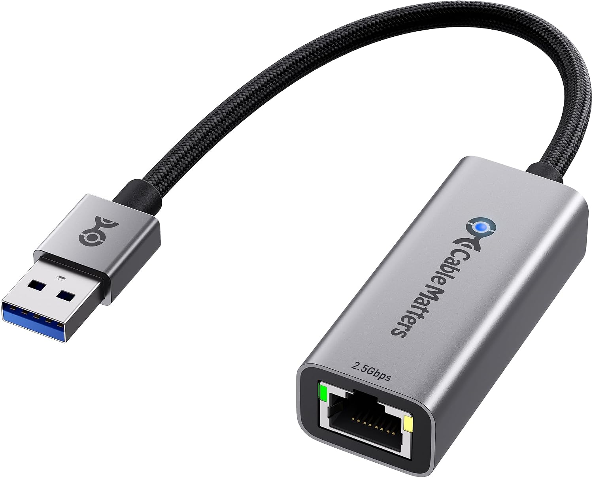

## August 8 2026 

So today I wanted to make a new post with some of the stuff I've been doing the past little while.  I have been struggling with hardware issues in my home office.  My home server was a Synology DSM where I had running many docker containers, a file server, a surveillance nvr, a media server, and a server log database.  Unfortunately, my hardware was getting maxed out and my services would slow down majorly.  Another issue I was having was power surges.  At the beginning of July, we had a storm that knocked out electricity for a while, and when it finally came back on, I guess it surged and ruined my Starlink power supply.  It was also just my luck that they seemed to be on back order, so after almost a month of no internet, I finally was able to get back online.  Due to all this, I decided it was time to make some changes to my home setup.  

--- 

<b> New Hardware </b>

<ul class="hardware">
  <li>
    
    MINISFORUM AMD Ryzen 9 9955HX MS-A2 Mini PC (16C/32T, up to 5.4GHz), 32GB DDR5 1TB SSD, PCIe×16, HDMI/2x USB-C (8K@60Hz), 2X SFP+ 10G, 2X 2.5G LAN, 3X SSD M.2 (2280/22110/U.2)
  </li>
  <li>
    
    Mikrotik CRS310-8G 2S in: L3 Smart Switch
  </li>
  <li>
    
    CyberPower CP1500PFCLCD PFC Sinewave UPS Battery Backup and Surge Protector, 1500VA/1000W, 12 Outlets, AVR, Mini Tower, UL Certified
  </li>
  <li>
    
    10Gtek SFP+ DAC Twinax Cable - 10GBASE-CU Passive Direct Attach Copper SFP Cable
  </li>
  <li>
    
    Cable Matters USB to 2.5Gb Ethernet Adapter, USB-A to RJ45 Network Adapter | 2500Mbps
  </li>
</ul>

--- 

<b> The Installation </b>

Along came migration/installation day.  I finally got everything installed and configured the way I wanted it.  So here is how I configured my setup.  I have <i><b>"atlas"</b></i> which is the minisforum pc, and that runs proxmox.  Then I have configured two different virtual machines, one with a linux debian OS, <i><b>"titan"</b></i> and one running windows, <i><b>"pandora".</b></i>  So I then migrated all of my docker containers, over to titan since it has much better computing power than the synology.  Now the synology hosts my media files through a 10GB SPF DAC cable connected to the new switch.  I also upgraded the default ethernet connection on the synology, so from the switch to the synology is a 2.5GB connection.  Which of course I had to run some third party software in order to detect the extra nic through usb.  

Everything is also now connected through battery & surge protection on the UPS.  So now I wont have to worry about my power surges taking out my equipment.  I am even able to keep my server up for roughly an hour during power outages, which is nice.  

I would like my next upgrade to be a new synology host, with upgraded ram and storage.  Right now my synology runs at 6GB of ram, and roughly a 11TB storage pool in synology RAID.  Eventually, I will upgrade the synology to a better unit with a better cpu, and a higher storage capacity.  However, that is an installation for another day! 

---

#### Thanks for reading... 

### Contact Me

As always, feel free to contact me for collaboration or just if you want to chat or give me some pointers.  Always up to meet new developers. 

Check out my Github profile or check me out on my website:     https://sterling-dev.com 