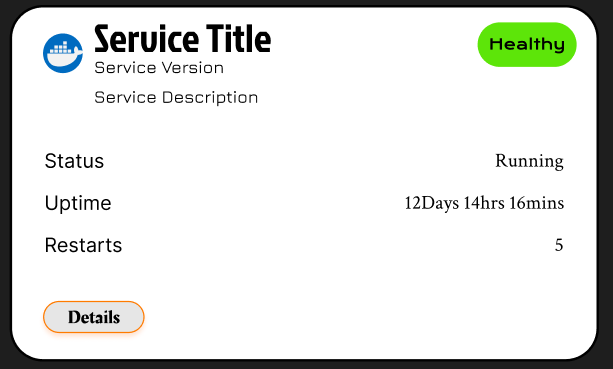
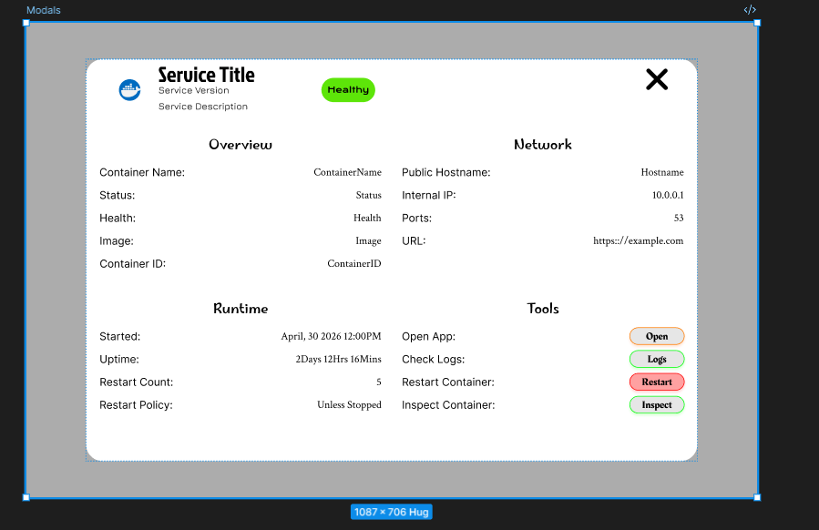

# May, 13th 2026  12:56PM 

I have been working in Figma lately, and I really enjoyed learning the platform.  The project behind this is a update to my server dashboard project.  I want to host a private HomeLab Dashboard that will bring all my services, monitoring, and logs, to one page.  I have created multiple components in Figma to use for my UI.  I have included screen shots of some of my designs, so be sure to let me know what you think.

## Designs

<table>
  <tr>
    <td valign="top">
      <h3>Service Card</h3>
      
    </td>
    <td valign="top" style="padding-left: 24px;">
      <h3>Service Details Modal</h3>
      
    </td>
  </tr>
</table>

My next task is to start backend development building the api routes for the metrics and logs.  I will try to update my dev journal as the project goes further.  I enjoy working on multiple projects, so I'm not always working on the same thing.  

--- 
---

## Contact Me

As always, feel free to contact me for collaboration or just if you want to chat or give me some pointers.  Always up to meet new developers. 

Check out my Github profile or check me out on my website:     https://sterling-dev.com 