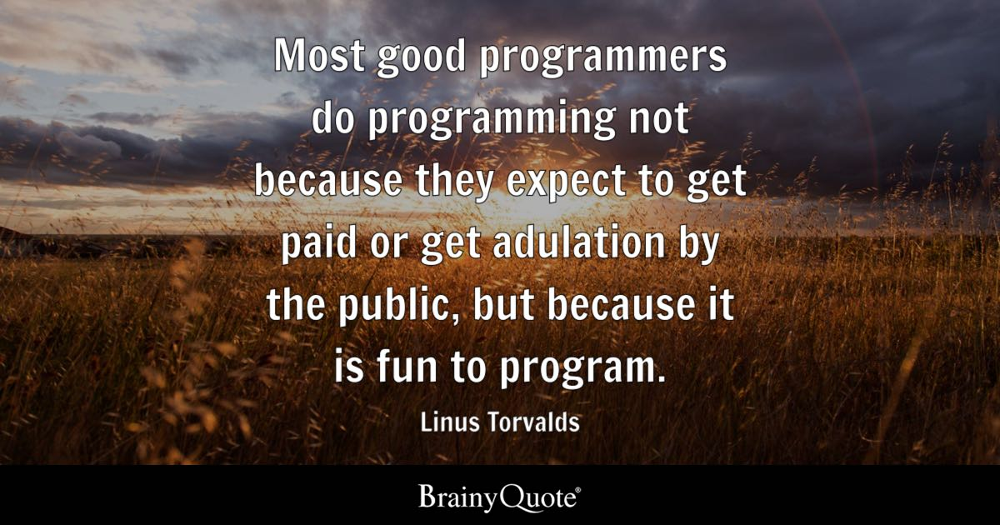

# May, 14th 2026  1:01PM 

--- 

--- 

I really like this quote because I feel that I fit into this.  I really enjoy the challenge of figuring out how to design your code to make it work the way you want to.  Sometimes that doesn't always go the way you want, but thats the fun part.  Eventually, after I solve the bug, I get excited and its thrilling to know that I was able to solve the challenge.  

One challenge that I have run across recently, was when I was updating my [Wizard's Quiz](https://github.com/ssterling9928/HarryPotterTriviaQuiz) app.  When I went to submit it to Apple, they ended up finding a bug that when you press buttons at an extremely fast rate, the game would crash at the end of the quiz.  So upon debugging my code, I found that my timer, that handled showing the correct answer, was causing the crash.  It seemed that the timer wasn't being cleared at the end of each question.  My fix, was to redesign the timer so that when the timer was active, the buttons were disabled.  This made it to where users could not press buttons extrememly fast, causing the timer to not be cleared.  Once the timer ran out, the buttons were reactivated and the timer was cleared.  This fixed my bug.  It's actually funny, because that bug was there in my first build, but was missed by both myself and Apple testers.  

--- 

At this time, I am still focusing on my Homelab Dashboard page.  Check back to see a project repo soon! 

Check out my portfolio and some of my work here:  [Sterling-Dev](https://sterling-dev.com)